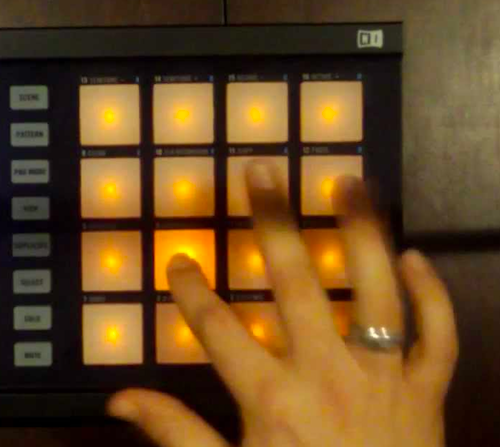
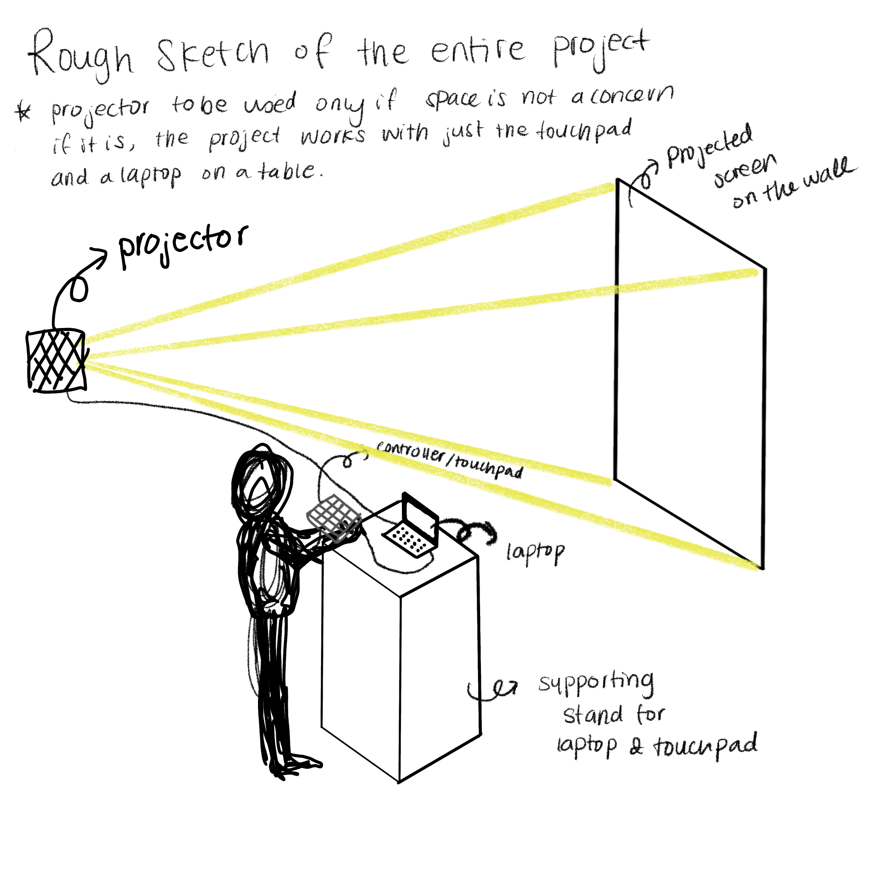
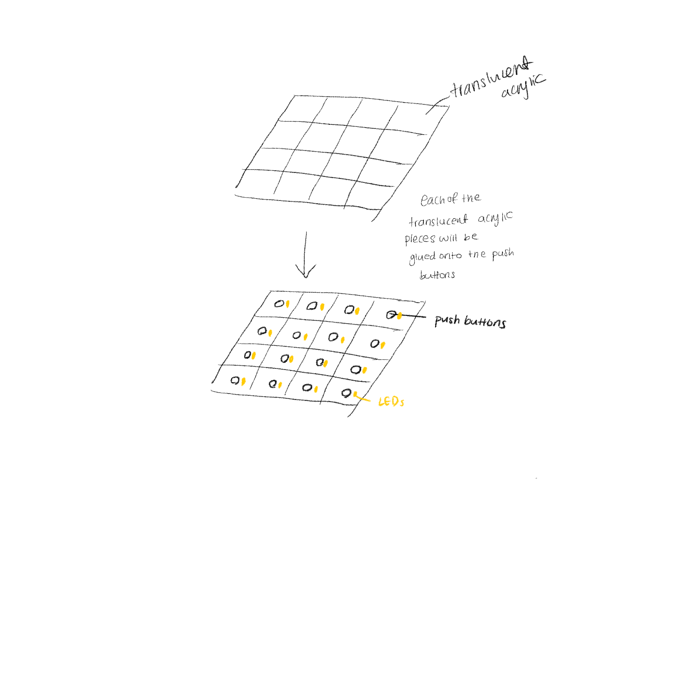
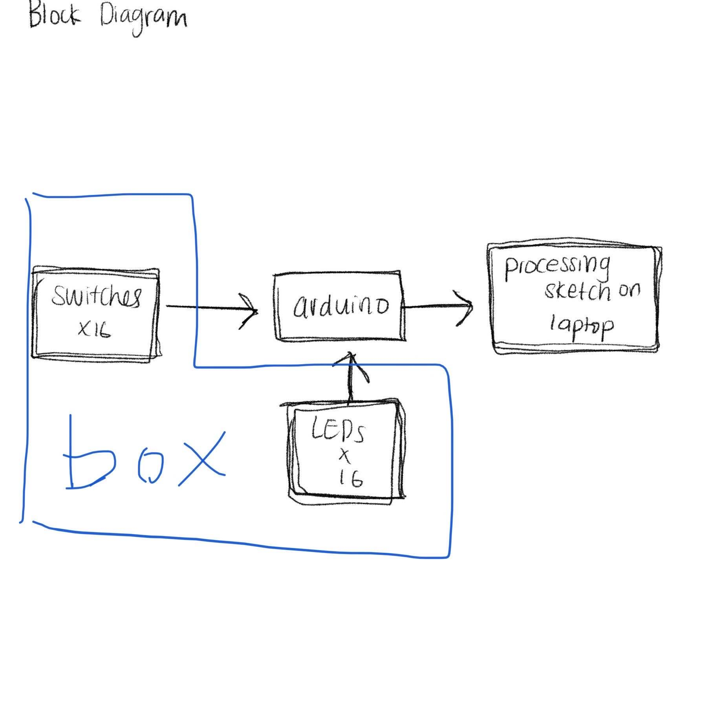

This is the project proposal;for project documentation, please go to https://github.com/annacxwang/Intro-to-Interactive-Media/tree/master/FinalProjectDocumentation

Final Project Proposal for Lucy and Chunxiao

**1.Project description**
- The project is to simulate a game console using a touchpad-like controller with sensors and arduino and processing program on a laptop.

- The controller is a box with mounted grid-touchpads. There are going to be 16 touchpad buttons mounted onto one side of the box. Underneath each touchpad grid there’s going to be a push button and an led. (see rough sketch below). 
- We are planning to implement a rhythm game using processing. (example :https://www.youtube.com/watch?v=kGzm4f35x_s) Multiple buttons will be lit randomly and the user will have to click the lit buttons within a given time. Points will be given for valid clicks and warning sound will be generated for wrong clicks.The will be a song being played in the background. As the game proceeds, the frequency and the speed of playback of the BGM will increase to increase the difficulty. If the user can reach a certain point threshold within a certain number of mistakes, he or she wins the game and gains access to a hidden mode.
- If time permits, we’ll also implement another game where players will be provided 8 pairs of pictures for several seconds. After the pictures are hidden, they’ll need to use the buttons on the touchpad to pair up the pictures. This can be an entry level game for the players before they proceed to the rhythm game described above.
- Hidden mode:  the mounted grid-touchpads light up in different colors. The winner gets to select a maximum of 5 colors by pressing the touchpads with corresponding colors. This adds onto a particle-system drawing where each of the colored grid touchpad they press input a single particle of a corresponding color onto the canvas. To put it more simply, it’s a ‘hall of fame’ but in a more abstract way. In the end, there will be an artwork where all the winners’ inputs are presented as one.
- Touchpad will be about 4 in. by 4 in. big

Example of particle-system:https://www.openprocessing.org/sketch/773983

**2. Rough sketch of the entire project**

- Preferably placed in a darker environment for better seen LED lights.

**3.Block diagram of the hardware including sensors, motors, speakers, etc.**

**4.List of parts you need that are not in your kit**
- A box enclosure (3mm thick cardboard)
- Laser cut translucent acrylic (1 in. by 1 in. x 16)
- Additional push buttons 
- Styrofoam (to be used under the touch pads)
- Arduino board with additional ports (at least 32 ports for 16-button touch pad)
- Neo pixel for 16 LEDs if applicable
- Headphone

**5.Description of the Arduino program**
- The Arduino program will receive signal from processing and light up different LEDs according to the signal.
- The Arduino program will send different signal to processing according to which push buttons are pressed.

**6.Description of the Processing program**
- The Processing program will generate a user interface to start game & keep track of score, time limit and lives.
- It will also given instructions for the two modes ( game mode and artistic mode).
- It will randomly generate a sequence of signals to send to Arduino and light up corresponding LEDs. When receive signals from Arduino generated by button pressings, the program will check if the received signals match the latest signals sent and update score accordingly. The program will also generate background sound.
- If the score goes above a certain threshold within some time, the program will switch to artistic mode with instruction of the mode.
- For the artistic mode, it will generate particle structures according to buttons the users press. Each user is restricted to press a maximum of  5 buttons. The input from the users will be stored on canvas so that other users can add onto the drawing.

**7.Things you need to learn that you don’t yet know**
- How to generate particle-systems
- Sound generation on Processing
- How to make use of neo pixel

**8.Areas of greatest concern**
- If the pressing of the buttons will be detected and responded fast enough for the game to function as proposed (possible delay of communication between Arduino and Processing).
- If this game doesn’t work out, we might need to switch to some other games.
- Construction of the box.

